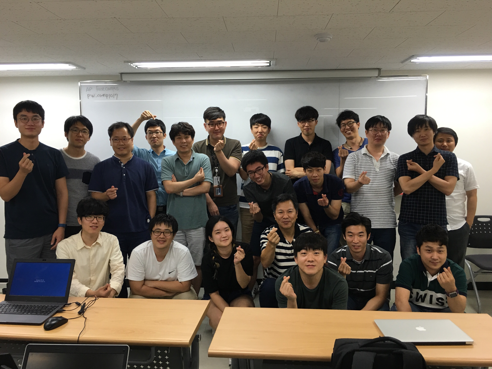
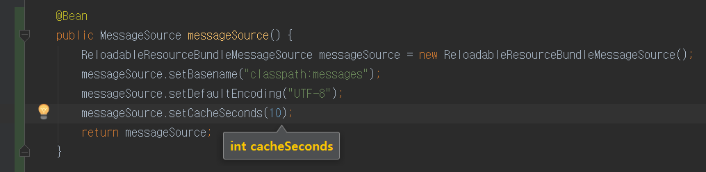
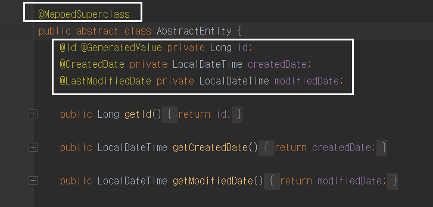
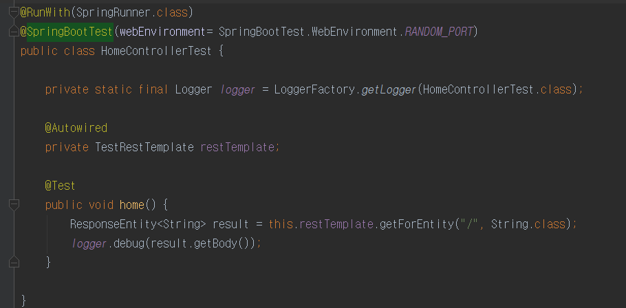

- [패스트캠퍼스 자바 웹 프로그래밍 CAMP](#-패스트캠퍼스-자바-웹-프로그래밍-camp)
    - [1일차 - TDD 시작](#1-tdd-)
    - [2일차 - HTTP 웹서버 실습](#2-http-)
    - [3일차 - HTTP 웹서버 리팩토링 실습](#3-http-)
    - [4일차 - HTTP 웹서버 코드리뷰](#4-http-)
    - [5일차 - MVC 프레임워크 1단계 구현 실습](#5-mvc-1-)
    - [6일차 - MVC 프레임워크 및 JDBC](#6-mvc-jdbc)
    - [7일차 - Ajax](#7-ajax)
    - [8일차 - 중간점검](#8-)
    - [9일차 - AWS 배포](#9-aws-)
    - [10일차 - Spring MVC](#10-spring-mvc)
    - [11일차 - Spring MVC 실습](#11-spring-mvc-)
    - [13일차 - Mockito를 활용한 테스트](#13-mockito-)
    - [14일차 - AOP](#14-aop)
    - [15일차 - Transactional & Cache & SpringBoot](#15-transactional-cache-springboot)
            - [Transactional](#transactional)
            - [Cache](#cache)
    - [16일차 - JPA 소개](#16-jpa-)
    - [17일차 - JPA + Profile](#17-jpa-profile)


# 패스트캠퍼스 자바 웹 프로그래밍 CAMP

(단체사진)
 * 자바지기(박재성)님의 [패스트캠퍼스 자바 웹 프로그래밍 CAMP](http://www.fastcampus.co.kr/dev_camp_jwp/) 강의 내용 정리
 * 광고 아니라 진심으로 150만원 상당의 수강료가 아깝지 않은 명품 강의였다.

## 1일차 - TDD 시작
* 일반적인 main()을 이용한 테스트 방식의 문제점
* 이클립스에서 Junit 사용법 (난 중간중간 인텔리제이로 검색해서 적용함)
* @Before 사용하는 이유 : 각 테스트들간의 고유한 객체를 생성해주기 위해 
* 선 테스트코드 작성후 실제 코드 개발
* 구현 -> 테스트 -> 리펙토링 과정으로 진행
* 테스트 메소드는 production 코드에서 exception을 던질수 있기 때문에 웬만하면 throws Exception을 추가하는게 좋다
* private 메소드의 테스트는 private를 지우고 테스트 or 해당 메소드를 class로 뽑아서(Refactor 사용) 진행도 가능
* Refactor 사용을 활성화 하자! (Method, Class 등)

## 2일차 - HTTP 웹서버 실습
* 순수 Java로 웹 서버 구축 - [프로젝트 코드] (https://github.com/jojoldu/web-application-server)
* 문자열 덧셈 게시판 못다한 이야기
* sum(toInts(split(text))) 을 람다식으로 표현
```
Arrays.stream(split(text)) 
.map(t -> Integer.parseInt(t))
.reduce(0, (number, sum) -> number + sum);
```
* RequestHandler는 Thread를 상속 받는다
* connection은 대기하다가, 사용자가 접속하면 Thread 객체를 생성한다. (즉, 사용자 1명당 Thread 객체 1개가 할당된다)
* 그럼 동접이 1만명 10만명인 경우 Thread가 1만개, 10만개가 생성되는가?

## 3일차 - HTTP 웹서버 리팩토링 실습
* 좋은개발자란? 
  - 20대~ 30대초반 : 기술적으로 뛰어난 개발자 
  - 30대 중,후반 : 협업과 소통이 잘되어 같이 일하고 싶은 개발자 
  - 현재 : 사람을 중심에 두면서 기술을 사용할줄 아는 개발자 
* Exception 
  - exception은 컴파일 exception 
  - 잘모르겠으면 throw new RuntimeException을 보낸다.
  - 통장에서 돈을 인출하려는데 잔액 부족할 경우 - checked exception 
  - DB연결이 끊길 경우 - unchecked exception 
  - 확실히 시스템 문제라면 unchecked exception, 그외에는 checked exception 
  - appender를 이용하면 별도의 코드 추가없이 모니터링 서비스로 에러로그를 보낼수가 있다.
* 복잡해진 웹 서버의 코드를 리팩토링 하자 - [프로젝트 코드] (https://github.com/jojoldu/web-application-server/tree/was-step1-bad-version) 
* 소켓이 생성되려면 서버의 IP/Port 와 클라이언트의 IP/Port가 필요하다
* TCP three-way handshake 
  - 3번에 걸쳐 서버와 클라이언트간 교환작업
  - DB와 웹서버의 경우 이 작업이 너무 크므로 웹서버와 DB간의 three-way handshake를 미리 완료하여 이를 connection pool에 담아서 이 작업을 최소화 한다.
  - 이게 가능한 이유는 클라이언트(즉, 여기선 DB)의 IP와 포트를 고정시킬수 있기 때문이다. 브라우저는 IP가 고정되어있지 않으므로 불가능하다.
* HTTP Status
  - 302를 만나면 브라우저는 location 헤더 값이 있겠구나고 생각하고, location에 있는 값으로 다시 서버에 요청한다. 모든 리다이렉트 API는 이러한 방식이다.
  - 200은 index.html을 body에 담아서 보내는거라 리다이렉트 되지 않는다.
* HTTP 상태 vs 무상태
  - 상태 protocol: 서버가 클라이언트의 상태값을 계속 갖고 있는 것(connection을 계속 이어간다.) 
  - 무상태 protocol: 서버가 클라이언트에 결과를 보내면 connection을 끊어버린다.
  - 세션은 정보를 서버에 저장하고, 세션 ID를 쿠키로 전달한다.
* CSRF 토큰: 주요 요청 직전에 발급하는 토큰으로, 이와 맞지 않으면 요청을 무효화시킨다.

## 4일차 - HTTP 웹서버 코드리뷰
* Github를 통해 관리해야하는 코드는?
  - build를 통해 생성되는 파일 (.settings, target 등)
  - 의존성 관리 툴(maven, gradle, npm, bower)을 통해 다운받는 라이브러리
  - IDE를 통해 생성되는 파일 (.project, .iml, .springbeans 등)
  - 모르겠으면 [gitignore.io](https://www.gitignore.io/)에서 java로 검색해서 제외해야할것 찾아서 .gitignore에 추가하자
  - Gradle 과 Maven 둘다 하기보다는 1개라도 잘하자
 
* 객체지향의 다형성에 익숙해지려면 어떻게 해야하나?
  - DB연동이 없고, UI를 고려하지 않는 프로젝트를 진행할것 (웹은 좋은 예제는 아니다)
  - ex) HTTP웹서버, 프레임워크 or 라이브러리, 체스게임, 지뢰찾기, 볼링게임점수판 등
  - [객체지향 생활 체조 총정리](https://developerfarm.wordpress.com/2012/02/03/object_calisthenics_summary/)의 내용을 참고
  - 하나의 프로젝트(주제)를 주기적으로 다시 만들어보자 여러 프로젝트를 하지 말자. 
    - 예를 들어 전사케릭을 50까지 키웠는데 재미없어서, 마법사케릭을 다시 키워서 50까지 키우니 재미없어서 궁수케릭을 다시 키우는 식이 될수있다. 
    - 하나의 케릭을 쭈욱 키우는게 더 높은 곳까지 갈 수 있다.

* HTTP 웹서버 코드리뷰 진행
  - 기존에 짠 코드를 테스트하는게 아니다
    - 테스트를 위해 기존 코드를 고치는 것이다. 즉, 테스트를 원하는 코드를 계속 method로 빼고, 세분화하자
  - 테스트하기 쉬운 코드 혹은 method는 input이 있고 return이 있어야 한다. (스칼라가 지향하는 방향과 동일하네?)
  - private method의 경우 method보다는 class가 오히려 더 잘어울릴수 있다. (힌트가 될수 있다)
  - logger같은 경우 IDE에 템플릿 등록해서 사용하면 반복작업을 최소화할수 있다.
  - 상태값을 가지는 객체의 경우 쓰레드마다 매번 객체 생성 해야하지만, 상태값이 없는 객체의 경우 재사용해야 한다.
  - 서블릿컨테이너 : 서블릿을 실행시켜주는 역할
  - 서블릿 컨테이너에서 서블릿 인스턴스는 1개만 생성되고 이를 재사용하는 방식이다.
  - 서블릿 컨테이너는 모든 사용자 요청에 대해 Thread를 생성해야하나? 1000명이 요청하면 1000개의 Thread가 필요한가? 
  - 서블릿 컨테이너는 서버가 생성할 수 있는 Thread수를 제한한다. 
    - Thread Pool을 사용해 제한된 **Thread를 재사용**한다.
    - Thread수를 초과한 사용자들은 큐에서 대기하여 처리될때마다 Thread를 할당한다. 
    - 그래서 Tomcat 설정에 maxThreads는 최대 Threads수, acceptCount는 큐의 최대 대기자수를 말한다.
  
* Servlet과 JSP 시작 - 1
  - @WebServlet과 extends HttpServlet 되어 있는 class를 등록한다. 

## 5일차 - MVC 프레임워크 1단계 구현 실습
* 배움 관련 이야기
  - 주변사람과의 비교는 결국 나를 초라하게 만든다.
* Servlet을 사용하여 MVC 프레임워크 구축하기
  - doGet, doPost를 사용하는 많은 Servlet Controller들을 Controller Interface 구현체로 만들어 리팩토링하기   

## 6일차 - MVC 프레임워크 및 JDBC
* MVC 프레임워크 Flow
  - 모든 요청은 중앙집중형 DispatcherServlet이 받는다. 요청에 대한 url을 RequestMapping에게 준다     
  - RequestMapping은 url에 해당하는 Controller를 DispatcherServlet에게 전달해준다.
  - DispatcherServlet은 RequestMapping에게 받은 Controller를 실행시킨다.
  - J2EE 패턴중 Front Controller패턴이라고 보면 된다. (DispatcherServlet가 Front Controller라고 보면 된다.) 
  - Controller은 사용자가 입력한 값에 대한 유효성 처리를 담당한다.
  - Controller은 Model과 View 사이를 연결하는 연결자 역할을 한다.
  - 비지니스 로직은 Model에서 구현해야 한다.
  - View는 Controller에게 받은 데이터를 출력시키기만 한다.

* 서블릿 Life Cycle
  - init() : 서블릿 생성시 처리할 내용을 담고 있는 메소드
  - service() : 실제 수행될 로직을 담당
  - destroy() : 후처리
  - 컨테이너 : 해당하는 것(서블릿, 빈)들의 라이프사이클을 관리하는 역할

* loadOnStartup
  - 서블릿컨테이너가 시작될때 해당 설정값을 가지고 있는 서블릿 인스턴스를 생성하고 init() 를 호출해준다.

* JDBC
  - 문제점3 : 서버를 재시작하면 데이터가 사라진다. 영구보존 할수있는 방법을 도입해보자.
  - DAO는 DB, 외부API등 데이터 접근과 관련한 모든 처리를 담당한다.
  - JDBC는 인터페이스이다. 각 DBMS의 드라이버를 구현체로 사용하기때문에 DBMS 교체가 용이하다.                                                                                                                             

## 7일차 - Ajax
* JDBC 코드리뷰 
  - Object... parameters : 가변인자 (배열처럼 쓸수있으며 없어도 컴파일 에러가 없음. 단, 인자의 마지막에만 위치할 수 있음)
  - try-with-resources는 AutoCloseable을 구현한 객체일 경우에만 가능하다
  - web.xml의 welcome-file-list는 root path로 접근시 무조건 먼저 읽게 하는 설정이다. 이를 수정해야 원하는 페이지로 이동가능

## 8일차 - 중간점검


## 9일차 - AWS 배포
 * 프로그래밍을 잘한다의 정의
   - 현재 처해있는 상황에서 가장 적합한 기술을 찾아 적용할 수 있는 사람

 * Baas를 통해 백엔드 개발자의 자리가 점점 사라지는것 아닌가
   - 프론트엔드, QA, DBA, 시스템 등 다른 영역과 백엔드를 연결하는 접점에 대한 수요가 점점 생기고 있다.
   - 좋은 서비스를 개발하기 위해서는 결국 타 영역으로 넘어가야하는 순간이 온다.
   - 백엔드에 일정수준에 도달하면 타 영역에 도전해보자.

 * 신기술 공부?
   - 나만의 색깔 찾기 -> 일정시간 투자해 역량 쌓기 -> 다른 분야로 관심사 넓히기 
   - 위 사이클을 반복하자
   - 가장 중요한건 내가 어떤것에 장점이 있고 나의 강점이 무엇인지 파악하기
   - 다른 사람이 뭐라해도 흔들리지 않는 자신만의 철학을 갖기

 * 중간 점검 피드백
   - 필터의 chain.doFilter()를 기준으로 전처리/후처리를 할수가 있음
   - MVC 프레임워크란 MVC를 제외한 나머지는 개발자가 개발하지 않아도 되는 프레임워크를 말한다.
   - stack vs heap (7번 문제) 
   - 쓰레드마다 고유의 stack영역을 가지지만 Heap은 모든 쓰레드가 공유한다. 
   - ShowController가 Heap영역에 있어, Question/answers 역시 Heap에 있고 이로인해 쓰레드가 요청시마다 필드인 Question/answers 가 유지가 안되서 문제가 발생한다.
   - Layered 아키텍처 : 여러개의 클래스 사이에 중복코드가 발생하면 Composition 패턴을 사용하는것이 좋다. 우리가 controller에서 service를 호출해 service에서 비즈니스로직을 위임하듯이

 * 실습 - AWS 배포

## 10일차 - Spring MVC
 * AWS 배포 리뷰
   - Symbolic link로 설정들을 잡아놓으면 이후 버전 업데이트시 변경양이 최소화됨
   - 웹서버들의 virtual host를 통해 동일 IP에서도 호스트에 따라 할당되는 프로젝트 다르게 처리가능
 
 * 스프링 MVC
   - 자세한 내용을 [Blog](http://jojoldu.tistory.com/28) 에 정리하였으니 참고하자.
   - POJO가 특정 클래스를 상속받지 않았는데도 Spring에서 관리되도록 할수 있는데 이는 해당 class를 Bean으로 관리되도록 설정할수있기 때문이다.  
   - DispatcherServlet는 서블릿 컨테이너가 관리하지만, 확장포인트가 있어 Spring에서 설정 수정이 가능하다.
   - BeanFactory를 applicationContext가 상속하고 있다. 그래서 Bean에 관련한 기능들은 BeanFactory가 하고 있고 그외에 추가적인 기능들은 ApplicationContext에 추가되어있다.
   - 테스트 코드 작성을 예로 들면
  ```
  ApplicationContext ac = new ClassPathXmlApplicationContext("applicationContext.xml"); 로 선언하면 Bean들을 다 사용할 수 있게 된다.
  ```

 * @Bean의 @Component 차이는? [Blog](http://jojoldu.tistory.com/27) 참고!

 * web.xml없이 개발하기
   - 서블릿 3.0부터 지원하는 ServletContainerInitializer(WebApplicationInitializer)를 통해 가능하다.

 * MVC 프레임워크 만들기
   - 새로운 Request 요청은 new MockHttpServletRequest("POST", "/users") 식으로 만들수 있다.

## 11일차 - Spring MVC 실습
 * spring-web의 META-INF/services를 보면 ServletContainerInitializer에 풀네임의 initializer가 지정되어 있다.
 * 열어보면 WebApplicationInitializer 인터페이스를 구현한 모든 클래스들을 초기화 시키는 코드가 있음을 알수 있다.
 * MyWebInitializer에는 GET/POST 외에 다른 HTTP Method를 받을수 있도록 꼼수로 ```<input type="hidden" name="_method" value="PUT"> ```로 지정하면 HiddenHttpMethodFilter 클래스가 처리해준다.
 * maven plugin에 downloadSources를 추가하면 이클립스에서 자동으로 jar를 attachment 해준다 (인텔리J는 자동으로 해줘서 신경안썼는데 유용할것같다!)
 * form의 input name은 model 객체의 field 이름과 매칭되는게 아니라 field의 set 메소드의 이름을 보고 자동으로 매칭을 시킨다.
 * Java Bean의 규약은 
   - Default 생성자를 명시 (Controller에서 자동 매칭되는것은 디폴트 생성자를 통해서 하기 때문에) 
   - getter/setter 메소드가 필수로 존재     

 * 2가지 경우 중 하나는 꼭 해당되어야하는 if문을 작성할 경우 보통은 if/else로 잡지만 좀 더 안전하게 가려면 if/else if로 정상path를 잡고 else로 throw new Exception 한다. exception에는 404나 500 같은 status를 추가한다.

## 13일차 - Mockito를 활용한 테스트
 * class에서 상태를 가진다는게 무슨 뜻인지?
   - 상태 == 데이터 
   - 메소드/함수 == 데이터(상태)를 변경 
   - 상태 (데이터)를 관리하는 방법 
     - 메소드의 인자를 활용
     - 클래스의 필드 상태값을 변경 가능하도록 구현 
     - 클래스의 필드 상태값을 변경 불가능하도록 구현 

 * static import : static 메소드들을 로컬 메소드처럼 메소드앞에 namespace 없이 바로 사용 가능하게 하는것
 * mockito
   - when : 어떤 메소드를 호출하면 
   - thenReturn : 여기에 포함된 값을 리턴시킨다. 
   - thenThrow : exception을 발생시킨다.
   - verify : 특정 객체가 몇번 호출 되면 등을 지정 
   - @RunWith(MockitoJUnitRunner.class) TestClass : mockito 사용환경 구축 
   - @Mock private UserDao userDao : userDao의 가짜 구현체를 생성 
   - @InjectMocks private UserService userService : 내가 지정한(@Mock) 을 해당 Bean의 @Autowired 객체에 대신하고 싶다. 

 * Junit
   - @Test(expected = 원하는 Exception.class) : 해당 메소드는 실행시 지정한 Exception.class가 무조건 발생한다로 비교

 * 객체지향적 코딩
   - 객체지향적인 코딩이란 상태를 가지고 있는 객체가 상태를 변경하도록 코딩을 해야한다.
   - 코드가 객체지향적이라면 mockito와 같은 테스트 프레임워크가 없더라도 테스트코드를 작성할수가 있다.
   - service가 비지니스로직의 모든것을 처리하진 않는다. 상태를 가지는 객체가 로직을 처리하는것이 맞다.
   - service는 도메인 객체들간의 관계를 정리하고, 캐시/트랜잭션들에 대한 처리를 할뿐이다.

 * 빈 컨테이너 설정 관리
   - 모든 Layer의 설정을 하나에서 관리 vs Layer별로 설정을 분리 
   - excludeFilters에 Controller.class를 지정해서 @ComponentScan에서 제외시키겠다.
   - includeFilters에 Controller.class를 지정해서 해당 어노테이션만 스캔하겠다.
   - 부모/자식 구조 : 프레젠테이션 Layer(Controller)만 다르고 Service/Dao설정을 재사용 

 * 인스턴스 추가/삭제
   - @PostConstruct : Bean이 생성되고 DI후, 바로 실행할 메소드 지정
   - @PreDestroy : Bean이 삭제되기 바로 직전에 실행할 메소드 지정

 * Property와 환경변수
   - reload resource bundle을 통해 주기적으로 properties를 체크해서 적용하도록 할수는 있다.
   - 변경이 있으면 안되는 DB설정 같은 경우는 제외하고, 자주 변경이 필요한 properties만 reload 설정에 포함시킨다. (설정간 분리가능)

## 14일차 - AOP
 * [AOP정리 참고](http://jojoldu.tistory.com/69)
 * properties는 한글을 유니코드로 관리하는게 디폴트다.
 * messageSource로 properties의 값을 몇초 주기로 리로딩할수 있다. 
 
 
 * AOP가 필요한 요구사항
   - 모든 Controller와 Dao에서 처리시간이 500ms 이상인 경우는 로그를 남겨라
   - Dao 클래스의 모든 method에 인자로 전달되는 인자를 debug 레벨로 로그를 남겨라

 * AOP가 해결하고자 하는것은 비지니스로직의 중복제거가 아닌 시스템 전반적인 중복을 제거하기 위함
   - 비지니스 로직 코드의 중복 제거 : OOP
   - 인프라 코드의 중복 제거 : AOP

 * FactoryBean : new 키워드를 통해 생성될수 없는 Bean들을 생성하기 위해 필요
   - 예를 들어, 기존 Bean에 몇가지 기능이 추가된 ProxyBean이 필요할때 FactoryBean을 implement하여 빈을 등록한다
   - 예전 xml로 Bean을 관리하던 시절에는 FactoryBean의 구현이 필요했지만 현재는 java code로 Bean등록이 가능하므로 현재는 잘쓰이지 않는다.

 * 용어
   - target : 부가기능을 부여할 대상
   - advice : target에 제공할 부가 기능을 담은 클래스
   - joinpoint : sadvice가 적용될 수 있는 위치, 예를 들어 method의 실행단계
   - pointcut : joinpoint를 선별하는 작업 또는 그 기능을 정의한 모듈

## 15일차 - Transactional & Cache & SpringBoot
#### Transactional
 * readOnly = true : select성 메소드에서는 성능이 더 좋아서 추천
 * isolation level : 하나의 데이터를 반영하는데 동시에 2명이상이 접근했을때 데이터를 어떻게 관리하는지에 대한 개념
   - tx1에선 select, tx2에선 update를 동시에 요청하면? isolation level마다 다르다. update후 select할지, select하고 update할지
 * isolation level의 레벨이 낮을수록 성능은 좋고 데이터 무결성 보장성을 낮춘다.

 * propagation : tx 생성 rule
 * propagation_required : default이며, 상위계층(service)에서 하위 계층(dao)요청시 하위계층에 tx가 없으면 **상위계층의 tx를 사용**한다
 * propagation_new : 상위계층(service)에서 하위 계층(dao)요청시 하위계층에 tx가 없으면 **새로운 tx를 만든다**
 * Spring transactional은 runtime exception일 경우에만 rollback되고 checked exception에서는 rollback되지 않는다
   - rollbackFor = checked Exception을 지정하여 사용할 수 있다.
 * 테스트 코드 작성시 Dao일 경우에는 테스트 후 DB를 원복시키고 싶을경우가 많으니 class 혹은 method에 @Transactional을 지정하면 된다.

#### Cache
 * @Cacheable(key="키값") : 해당하는 키값을 캐시하도록 지정 
 * @CacheEvict(key="키값") : 해당하는 키값이 변경되면 캐시데이터를 변경하도록 한다
 * 직접 만든 캐시를 해당 어노테이션으로 관리하고자 한다면 CacheManager 구현체를 만들고 지정하면 된다

## 16일차 - JPA 소개
 * 설계 패러다임의 변경: Table -> Object
 * 대세는 쿼리매퍼에서 ORM으로 넘어가고 있다. (C#, 루비등 타언어에선 이미 ORM이 대세)
 * 하이버네이트와 달리 SpringDataJpa는 interface의 메소드 네이밍으로 조건절 생성
 * @Transient : DB 컬럼과 맵핑되는것에서 제외시킨다.
 * @ManyToOne을 지정했다고해서 반대편 Entity에 꼭 OneToMany를 할필요는 없다.

## 17일차 - JPA + Profile
  * @MappedSuperclass : 


 * @JpaTest (SpringBoot 1.4부터 지원)
 * 객체지향적인 코딩이란 객체들끼리 서로 협력해서 일을 처리하도록 하는것
   - 만약 서비스 메소드에서 직접 필요한 객체를 가져오는 일을 다 하고 있다면 절차지향적인 방법일 확률이 높다

 * API 서버 구축 도구
   - [Swaggger2](http://www.baeldung.com/swagger-2-documentation-for-spring-rest-api) : API를 문서화할수 있는 도구 [상세 내용](http://jojoldu.tistory.com/31)
   - restTemplate & @SpringBootTest

   

 * Flyway DB
   - 테이블 스키마의 버전관리 (DB계의 Git이라 보면 됨)
   - 네이밍 규칙: V숫자__설명
     - ex) V1__init_db_schema.sql
   - Spring Boot 설정 파일에 spring.jpa.show-sql=true로 설정되어 있으면 서버가 시작할 때 생성되는 테이블 스키마, foreign key 생성 쿼리를 확인할 수 있다.
   
